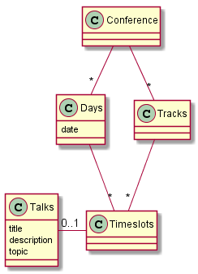

# PGR200 Innlevering 2: JDBC og databaser

Innleveringsfrist: 1. november.

## Oppgave

Dere skal utvikle et enkelt program som kan lese og skrive informasjon til en database. Programmet skal lese og skrive foredrag til en konferanse med foredrag fordelt over flere dager, tidspunkt og parallelle sesjoner. Programmet trenger ikke å håndere avansert brukerinput med mindre dere ønsker det som en oppvarming til eksamen.

Programmet skal følge god programmeringsskikk: Det skal ha enhetstester, det skal ha en god README-dokumentasjon, det skal hente inn konfigurasjon fra en .properties-fil. Det bør også bygge automatisk på [Travis CI](https://travis-ci.com).

Pass på at det er godt med tester, at koden kompilerer og kjører ok med "mvn test" og at du beskriver hvordan man tester løsningen manuelt.

Eksempel kjøring:

```bash
> mvn test
> mvn package
> Oppdater innlevering.properties med database settings
> java -jar target/database-innlevering.jar resetdb
> java -jar target/database-innlevering.jar insert "Mitt foredrag"
> java -jar target/database-innlevering.jar list
```

Dere skal trene på parprogrammering under innleveringen. I tillegg til koden i GitHub skal dere ta opp en video på 3-8 minutter der dere parprogrammerer. Velg gjerne en bit med kode som dere refactorerer. Screencast-o-matic anbefales som verktøy for video-opptaket, men andre verktøy kan benyttes. En lenke til videoen skal leveres og ikke videoen selv. Husk å åpne for tilgang til videoen ("unlisted" i Youtube) og legge inn lenke fra README.

Dere skal også gi tilbakemelding på en annen gruppes besvarelse. Tilbakemeldingen skal skrives i en egen fil (tilsvarende format som en README-fil) og inkluderes både i deres prosjekt og den andre gruppens prosjekt. Tilbakemeldingen dere har mottatt skal ligge i en fil som heter `MOTTATT-TILBAKEMELDING.md` og tilbakemeldingen dere har gitt skal hete `GITT-TILBAKEMELDING.md`.


### Datamodell:



## Sjekkliste for innleveringen

- [ ] Kodekvalitet
    - [ ] Produserer `mvn package` en executable jar? (tips: Bruk `maven-shade-plugin`)
    - [ ] Bruker koden Java 8 og UTF-8
    - [ ] Bygger prosjektet på https://travis-ci.com?
    - [ ] Har du god test-dekning? (tips: Sett opp jacoco-maven-plugin til å kreve at minst 65% av linjene har testdekning)
    - [ ] Kobler main-klassen seg opp mot PostgreSQL ved hjelp av en properties-fil?
    - [ ] Kan main-klassen resette databasen? (tips: Bruk Flyway#clear)
- [ ] Funksjonalitet
    - [ ] Kan man legge inn et nytt foredrag?
    - [ ] Kan man liste foredrag i databasen?
    - [ ] Valgfritt: Oppretter main-klassen et konferanseprogram med flere dager og tracks?
    - [ ] Valgfritt: Kan main-klassen vise konferanseprogrammet?
- [ ] Dokumentasjon i form av README.md
    - [ ] Navn og Feide-ID på dere de som var på teamet
    - [ ] Inkluderer dokumentasjonen hvordan man tester ut funksjonaliteten programmet manuelt? (Inkludert eventuell ekstra funksjonalitet dere har tatt med)
    - [ ] Inkluderer dokumentasjonen en evaluering av hvordan man jobbet sammen?
    - [ ] Inkluderer dokumentasjonen en screencast av en parprogrammeringsesjon?
    - [ ] Inkluderer dokumentasjonen en evaluering _fra_ en annen gruppe og en evaluering _til_ en annen gruppe?
    - [ ] Inkluderer dokumentasjonen et databasediagram
    - [ ] Inkluderer dokumentasjonen en link til screencast av programmeringsesjon?

## Forberedelse

- [ ] Finn en grupperpartner innen 16. oktober
    - [ ] De som ikke har en partner innen 16. oktober blir tildelt en annen
- [ ] Finn en gruppe for gjensidig evaluering innen 23. oktober

## Innlevering

1. Husk å endre README.md-fila. Her skal dere skrive hvordan man tester ut serveren. Dere kan også skrive en vurdering av deres eget resultat. Husk å skrive hvem dere begge er slik at vi ser hvem som har levert sammen.
2. Tag repositoriet med "innlevering" for å markere den committen dere vil leverer inn på. Dere kan jobbe videre dersom dere vil utforske oppgaven videre, men dere vil få tilbakemelding på "innlevering"-taggen. Her er git kommandoene:
  * git tag innlevering
  * git push --tags
3. Dere vil nå se taggen repository på github.com ved å trykke på "1 Release" (rett ved siden av antall commits etc). Her vil det være en link for zip-fil. Denne kan dere laste opp i Wiseflow.
4. Det er fint om du legger til veilederne hakonschutt og mudasar187 som collaborators under Settings > Collaborators på github.com, så sparer dere oss for tid.

Det er zip-fila som er den offisielle innleveringen, men dere vil få praktisk tilbakemelding via github.


# Avansert Java Innlevering nr. 2

## Hvordan kjøre koden
    Disse instruksjonenen vil hjelpe deg å kjøre koden lokalt på egen maskin, samt se output i fritt valg av database-software.

## Nødvendig verktøy for å kunne kjøre koden
    For å kunne kjøre koden trenger man følgende software:

    * Java Runtime Environment 8+ 
    * Valgfri IDE, eks: IntelliJ eller Eclipse
    * Java SDK 10+
    * Maven 3.x.x
    * PostgreSQL 9.5
    * Valgfri database-program, eks: DBeaver eller DataGrip.
    * Flyway
    * h2database
    * Junit 5

## Installering 
    For å kjøre koden er man nødt til å ha installert alle dependecies nevt ovenfor, deretter er man nødt til å starte postgresql lokalt på maskinen. Dette kan man gjøre via terminalen, eks: >brew services start postgres, og man må endre username og passord i database-programmet til "username: admin" og "password: admin", test gjerne connection før man kjører koden.

## Kjøre tester
    For å kjøre testene i DatabaseMainTest, trykker man på konfigurasjonsvinduet, og her kan man velge å kjøre hver test for seg selv, eller alle samtidig. For å kjøre testene i maven, åpner man et terminal-vindu, og skriver følgende: >mvn test.

## Prosjektet er bygget med
    Java:       Valgt programmeringsspråk 
    Maven:      Test-rammeverk 
    PostgreSQL: Open-Source database

## Versjonkontroll
    Vi benyttet GitHub som versjonkontroll. 

## Utviklere
    Ben Nicholay Gyllenhaal Johansen - @TheRealJohnD0e
    Erik Jacobsen - @Erikjac98


